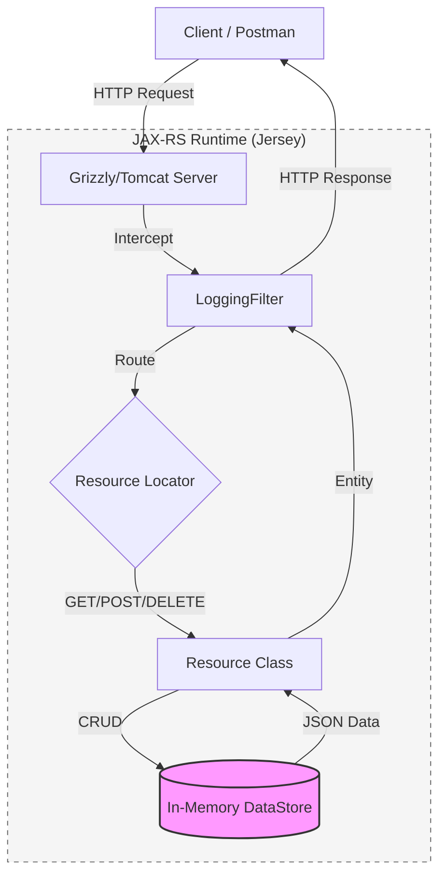

# 🏛️ SmartCampusAPI
### *Next-Generation RESTful API for Smart Campus Management*

[](https://jakarta.ee/specifications/restful-ws/)
[](https://www.oracle.com/java/)
[](https://maven.apache.org/)

---

## 📖 Overview
The **SmartCampusAPI** is a sophisticated, stateless RESTful service engineered using **JAX-RS (Jakarta REST)**. It serves as the digital backbone for a modern campus, providing real-time management of physical spaces (Rooms) and IoT infrastructure (Sensors). Designed with high availability and thread safety in mind, it utilizes advanced JAX-RS patterns such as Sub-Resource Locators and Custom Exception Mapping.

### 🌟 Key Pillars
*   **Performance:** Optimized in-memory operations using `ConcurrentHashMap`.
*   **Discoverability:** Full HATEOAS-compliant discovery endpoint.
*   **Robustness:** Global error handling with semantic HTTP status codes.
*   **Observability:** Comprehensive request/response logging via JAX-RS filters.

---

## 🏗️ System Architecture



---

## 🚀 Getting Started

### 📋 Prerequisites
*   **Java JDK 11** or higher
*   **Apache Maven 3.6+**

### 🛠️ Build & Installation
```bash
# 1. Clone the repository
git clone https://github.com/ShaviniFernando/SmartCampusAPI.git

# 2. Navigate to project directory
cd SmartCampusAPI

# 3. Build the fat JAR
mvn clean package
```

### 🏃 Running the Service
You can run the API either as a standalone application (embedded Grizzly) or deploy it to a container (Tomcat).

**Option A: Development Mode (Grizzly)**
```bash
# Start the server directly from source
mvn exec:java
```

**Option B: Servlet Mode (Tomcat)**
Deploy the generated `target/ROOT.war` to your Tomcat `webapps` folder. The API will be accessible at `http://localhost:8080/ROOT/api/v1`.

---

## 📡 API Reference

### 🗺️ Discovery & Navigation
| Endpoint | Method | Description |
| :--- | :--- | :--- |
| `/api/v1/` | `GET` | **API Discovery:** Returns version and HATEOAS links. |

### 🏠 Room Management
| Endpoint | Method | Description |
| :--- | :--- | :--- |
| `/api/v1/rooms` | `GET` | Retrieve all registered rooms. |
| `/api/v1/rooms` | `POST` | Register a new room. |
| `/api/v1/rooms/{id}`| `GET` | Get detailed metadata for a specific room. |
| `/api/v1/rooms/{id}`| `DELETE`| Remove a room (blocked if sensors are linked). |

### 🌡️ Sensor Network
| Endpoint | Method | Description |
| :--- | :--- | :--- |
| `/api/v1/sensors` | `GET` | List all sensors (Supports `?type=` filter). |
| `/api/v1/sensors` | `POST` | Register a sensor to a room (Atomic update). |
| `/api/v1/sensors/{id}`| `GET` | Get real-time sensor status. |

### 📊 Historical Data (Sub-Resource)
| Endpoint | Method | Description |
| :--- | :--- | :--- |
| `/api/v1/sensors/{id}/readings` | `GET` | Retrieve time-series history for a sensor. |
| `/api/v1/sensors/{id}/readings` | `POST` | Ingest new telemetry data. |

---

## ⌨️ Sample Operations (cURL)

> [!TIP]
> Use these commands to quickly verify your installation.

```bash
# 1. API Discovery (HATEOAS Links)
curl -X GET http://localhost:8080/api/v1/

# 2. Register a New Room
curl -X POST http://localhost:8080/api/v1/rooms \
  -H "Content-Type: application/json" \
  -d '{"id":"LAB-101","name":"AI Research Lab","capacity":25}'

# 3. Retrieve All Registered Rooms
curl -X GET http://localhost:8080/api/v1/rooms

# 4. Register a Sensor (Linked to Room)
curl -X POST http://localhost:8080/api/v1/sensors \
  -H "Content-Type: application/json" \
  -d '{"id":"TEMP-01","type":"Temperature","status":"ACTIVE","currentValue":22.5,"roomId":"LAB-101"}'

# 5. Filter Sensors by Type
curl -G http://localhost:8080/api/v1/sensors --data-urlencode "type=Temperature"

# 6. Post a Sensor Reading (Updates Current Value)
curl -X POST http://localhost:8080/api/v1/sensors/TEMP-01/readings \
  -H "Content-Type: application/json" \
  -d '{"id":"R-1001","timestamp":1713960000000,"value":24.3}'
```

---

## 📝 Part 2: Technical Report & Design Analysis

### 🟢 Part 1: Core Architecture & Discoverability

#### 1.1 JAX-RS Resource Lifecycle & Thread Safety
**Question:** *Explain the default lifecycle of a JAX-RS Resource class. How does this impact managing in-memory data structures?*

**Analysis:** By default, JAX-RS resources operate on a **Request-Scoped** lifecycle. This means the JAX-RS runtime (Jersey) instantiates a new object for every incoming HTTP request and discards it once the response is dispatched. 
*   **Implication:** Because resource instances are ephemeral, class-level fields cannot be used to store persistent state. 
*   **Solution:** We implement a centralized `DataStore` using `static` collections. To ensure thread safety in a multi-threaded environment (where multiple requests might modify the state concurrently), we utilize **java.util.concurrent** structures like `ConcurrentHashMap`. This provides high-performance, lock-free reads and thread-safe writes, preventing race conditions without the bottleneck of heavy synchronization.

#### 1.2 The Strategic Value of HATEOAS
**Question:** *Why is HATEOAS considered a hallmark of advanced RESTful design?*

**Analysis:** **HATEOAS** (Hypermedia as the Engine of Application State) elevates an API to Level 3 of the Richardson Maturity Model. By providing dynamic URIs in the response (as seen in our `/api/v1/` root), the API becomes **self-discoverable**. 
*   **Benefit:** It decouples the client from the server’s URI structure. If the endpoint paths change, the client—which follows links rather than hardcoding URLs—continues to function without modification. This significantly enhances the system's evolvability and reduces the maintenance burden on client-side developers.

### 🔵 Part 2: Resource Representation & Idempotency

#### 2.1 Payload Optimization: IDs vs. Full Objects
**Question:** *What are the implications of returning only IDs vs full room objects in a sensor response?*

**Analysis:** This is a classic trade-off between **Bandwidth** and **Latency (N+1 Problem)**.
*   **Returning IDs only:** Reduces initial payload size and saves network bandwidth. However, it forces the client to perform multiple subsequent "follow-up" requests to fetch the details of each referenced resource, increasing total latency.
*   **Returning Full Objects:** Minimizes the number of round-trips (reducing latency) but results in larger payloads and potential data redundancy. 
*   **Our Design:** We favor the ID approach to maintain a "flat" resource structure, ensuring high performance for mobile or bandwidth-constrained clients, while providing dedicated endpoints for detail retrieval.

#### 2.2 Formal Idempotency of the DELETE Method
**Question:** *Is DELETE idempotent in your implementation? Justify your answer.*

**Analysis:** **Yes**, our implementation is strictly idempotent. Idempotency defines an operation where multiple identical requests have the same effect on the **server state** as a single request. 
*   **Scenario:** The first `DELETE` request removes the resource and returns `204 No Content`. Subsequent requests find that the resource is already gone and return `404 Not Found`. 
*   **Justification:** Although the HTTP status codes differ, the side effect on the server is identical: the resource remains deleted. In REST, the *state* of the resource is the deciding factor for idempotency, not the response code.

### 🟡 Part 3: Content Negotiation & Collection Filtering

#### 3.1 Content-Type Integrity & @Consumes
**Question:** *What happens technically if a client sends an unsupported Content-Type (e.g., XML)?*

**Analysis:** JAX-RS uses **Content Negotiation** to ensure data integrity. Our methods are annotated with `@Consumes(MediaType.APPLICATION_JSON)`. If a client sends `application/xml`, the JAX-RS runtime performs a pre-flight check on the headers. Before the business logic is even reached, the server rejects the request with a **415 Unsupported Media Type** status. This prevents the application from attempting to parse incompatible data formats, maintaining a strict contract between client and server.

#### 3.2 Filtering Strategy: @QueryParam vs. Path-based Design
**Question:** *Why is the query parameter approach superior for filtering collections?*

**Analysis:** In RESTful design, **Path Parameters** are used for *identity* (e.g., `/sensors/101`), whereas **Query Parameters** are used for *attributes* (e.g., `?type=CO2`).
*   **Superiority:** The query parameter approach is more scalable. It allows for optional, combinable filters (e.g., `?type=CO2&status=ACTIVE`) without creating an exponential number of hardcoded URL paths. It keeps the URI space clean and follows the standard industry convention for searching and filtering.

### 🔴 Part 4: Sub-Resources & Modularity

#### 4.1 Architectural Benefits of Sub-Resource Locators
**Question:** *Discuss the benefits of delegating to separate classes for sub-resources.*

**Analysis:** We utilize the **Sub-Resource Locator** pattern to manage the `/sensors/{id}/readings` path. Instead of bloating the `SensorResource` class, we delegate the logic to `SensorReadingResource`.
*   **Separation of Concerns:** Each class focuses on a single level of the resource hierarchy, adhering to the Single Responsibility Principle.
*   **Maintainability:** It prevents the creation of "God Classes." As the API grows, sub-resources can be independently tested and modified without impacting the parent resource logic, leading to a much cleaner and more modular codebase.

#### 5.1 Resource Conflict Management (HTTP 409)
**Scenario:** *Attempting to delete a Room that still has Sensors assigned to it.*

**Analysis:** To maintain referential integrity, the API prevents the deletion of rooms that are "occupied" by active hardware. When a `DELETE` request is received, the system checks the room's `sensorIds` list. If not empty, we throw a custom `RoomNotEmptyException`. Our Exception Mapper translates this into a **409 Conflict**, informing the client that the request cannot be completed due to the current state of the resource (the presence of linked sensors).

#### 5.2 Semantic Accuracy: HTTP 422 vs. 404
**Question:** *Why is HTTP 422 often considered more semantically accurate than a standard 404 when the issue is a missing reference inside a valid JSON payload?*

**Analysis:** Semantic accuracy is vital for API usability. 
*   **404 Not Found:** Implies the URL itself is wrong.
*   **422 Unprocessable Entity:** Indicates that the URL and JSON syntax are correct, but the request contains **semantically invalid data** (e.g., a `roomId` that doesn't exist). 
*   **Benefit:** Using 422 provides the client with specific feedback that the error lies in the *data provided*, not the *endpoint targeted*, facilitating much faster debugging.

#### 5.3 State Constraints & Business Logic (HTTP 403)
**Scenario:** *A sensor marked as "MAINTENANCE" cannot accept new readings.*

**Analysis:** This implements a **State Constraint**. When a new reading is POSTed, the API inspects the parent sensor's status. If the status is `MAINTENANCE`, the request is rejected with a `SensorUnavailableException`, mapped to **403 Forbidden**. This correctly communicates that while the client is authenticated and the resource is found, the specific operation is "forbidden" because of the current operational state of the hardware.

#### 5.4 Cybersecurity: The Danger of Stack Traces
**Question:** *From a cybersecurity standpoint, explain the risks associated with exposing internal Java stack traces to external API consumers. What specific information could an attacker gather from such a trace?*

**Analysis:** Exposing stack traces is a critical security vulnerability known as **Information Leakage**. An attacker can extract:
1.  **Framework Versions:** Allowing them to target known exploits (CVEs).
2.  **Internal File Paths:** Revealing the server's directory structure.
3.  **Database Schemas:** Inferred from persistence-related errors.
4.  **Logic Vulnerabilities:** Revealing exact class names and method flows.
Our API uses a `GlobalExceptionMapper` to catch all unhandled errors and return a sanitized **500 Internal Server Error** without sensitive details.

#### 5.5 Decorator Pattern: JAX-RS Filters for Logging
**Question:** *Why is it advantageous to use JAX-RS filters for cross-cutting concerns like logging, rather than manually inserting Logger.info() statements inside every single resource method?*

**Analysis:** This is an implementation of **Aspect-Oriented Programming (AOP)** principles. 
*   **DRY (Don't Repeat Yourself):** Centralizing logging in a `LoggingFilter` ensures that every request/response is captured automatically.
*   **Clean Business Logic:** It keeps our resource methods focused purely on business requirements rather than infrastructure concerns.
*   **Reliability:** It eliminates the risk of a developer forgetting to add a log statement to a new endpoint, ensuring 100% audit coverage across the entire API.

---

## 🛠️ Error Handling Summary
The API implements a robust error-mapping layer to ensure consistent and informative responses:

| Status Code | Meaning | Context |
| :--- | :--- | :--- |
| `201 Created` | Success | Resource successfully created. |
| `204 No Content` | Success | Resource deleted/updated successfully. |
| `400 Bad Request` | Client Error | Invalid JSON syntax or missing required fields. |
| `403 Forbidden` | Client Error | Sensor is in `MAINTENANCE` mode. |
| `404 Not Found` | Client Error | Target resource does not exist. |
| `409 Conflict` | Client Error | Business rule violation (e.g., deleting a room with sensors). |
| `415 Unsupported Media Type` | Client Error | Client sent non-JSON data. |
| `422 Unprocessable Entity` | Client Error | Referenced `roomId` does not exist. |
| `500 Internal Server Error` | Server Error | An unexpected error occurred (Details hidden). |

---
*Developed as part of the Smart Campus IoT Initiative.*